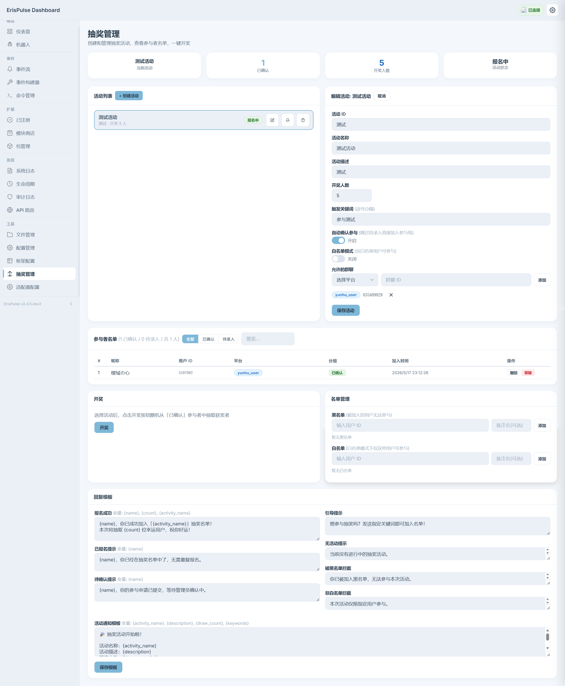

# ErisPulse-Raffle

通用抽奖模块 - 基于 ErisPulse Dashboard 可视化管理，支持群聊关键词报名、开奖动画、广播通知、兑奖系统。

## 功能

- **Dashboard 管理** - 可视化创建/编辑活动、管理参与者、黑白名单、一键开奖
- **关键词报名** - 用户在群聊中发送指定关键词即可参与，无需 @机器人
- **多平台支持** - 通过适配器同时支持云湖、Telegram、OneBot 等平台
- **开奖撤回** - 开奖后可撤回结果，恢复为报名中状态
- **活动通知** - 从 Dashboard 向任意平台/会话发送活动开始通知（支持多目标批量发送）
- **开奖广播** - 开奖后自动向所有关联群聊广播结果
- **富文本降级** - `/raffle` 命令根据平台能力自动选择 Html / Markdown / 纯文本
- **模板自定义** - 所有回复消息（报名、广播、通知等）均可自定义
- **兑奖系统** - 支持三种兑奖方式：直接发送内容、自定义信息收集、自定义说明
- **好友添加提醒** - 中奖者添加机器人为好友时自动发送兑奖提醒

## 安装

```bash
epsdk install Raffle
```

## 使用

### 群聊报名

用户在已关联的群聊中发送活动关键词即可自动报名：

```
抽奖          # 发送配置的关键词即可参与
```

### 查看活动

```
/raffle       # 查看自己已参与的活动 + 当前群聊的活动
/活动          # 同上，中文别名
```

### Dashboard 管理

安装 [ErisPulse-Dashboard](https://pypi.org/project/ErisPulse-Dashboard/) 后，在侧边栏「工具」分组中找到「抽奖管理」。

## 活动配置项

| 配置 | 说明 |
|------|------|
| 活动 ID | 唯一标识，留空自动生成 |
| 活动名称 | 显示名称 |
| 活动描述 | 简短描述 |
| 开奖人数 | 抽取的中奖者数量 |
| 触发关键词 | 逗号分隔，用户发送包含关键词的消息即视为报名 |
| 自动确认参与 | 开启后跳过「待录入」状态，直接加入已确认组 |
| 白名单模式 | 仅白名单中的用户可以参与 |
| 允许的群聊 | 指定哪些平台/群聊可以参与本次活动 |

## 兑奖系统

开奖后，中奖者可通过兑奖关键词（如「兑奖」「领奖」）触发兑奖流程。管理员在创建/编辑活动时配置兑奖方式：

### 兑奖方式

| 方式 | 说明 |
|------|------|
| 直接发送内容 | 中奖者触发兑奖后，自动发送预设内容（支持按用户自定义内容） |
| 收集信息 | 中奖者触发兑奖后，通过多轮对话逐项收集管理员自定义的字段信息 |
| 自定义说明 | 中奖者触发兑奖后，发送自定义说明文字，引导用户完成兑奖 |

### 收集信息

管理员在活动表单中自定义收集字段（字段标识 + 提示语），兑奖时按顺序逐项询问中奖者。字段完全由管理员定义，无预设限制。

### 好友添加提醒

开启后，当中奖者添加机器人为好友时，自动发送兑奖提醒消息。系统会扫描所有已开奖活动，匹配中奖者身份。

### 兑奖配置项

| 配置 | 说明 |
|------|------|
| 兑奖方式 | 三选一：直接发送 / 收集信息 / 自定义说明 |
| 兑奖触发词 | 逗号分隔，用户发送包含触发词的消息即触发兑奖 |
| 发送内容 | 「直接发送」方式下发给中奖者的内容 |
| 收集字段 | 「收集信息」方式下自定义收集的字段列表 |
| 自定义说明 | 「自定义说明」方式下展示给中奖者的文字 |
| 监听好友添加 | 中奖者加好友时是否自动提醒 |
| 用户专属内容 | Dashboard 中按用户设置不同的直接发送内容 |

### 兑奖记录

Dashboard 中的「兑奖记录」面板展示所有兑奖记录，管理员可：
- 查看收集到的用户信息
- 标记兑奖状态为「已完成」
- 为特定用户编辑专属发送内容

## 通知功能

在 Dashboard 中点击活动旁的铃铛按钮，可向指定目标发送活动通知：

- 选择平台、会话类型（私聊/群聊/频道/服务器/话题）、目标 ID
- 可选指定机器人账号（多 Bot 场景）
- 支持添加自定义备注内容（追加到模板末尾）
- 支持多目标批量发送
- 发送历史记录 + 一键重发

## 回复模板

所有回复消息均可在 Dashboard「回复模板」区域自定义：

| 模板 | 触发场景 | 变量 |
|------|---------|------|
| 报名成功 | 用户首次成功报名 | `{name}`, `{count}`, `{activity_name}` |
| 已报名提示 | 用户重复报名 | `{name}` |
| 待确认提示 | 手动确认模式下报名 | `{name}` |
| 开奖广播 | 开奖后广播到关联群聊 | `{activity_name}`, `{winner_names}`, `{winner_count}`, `{total_participants}` |
| 活动通知 | 从 Dashboard 发送通知 | `{activity_name}`, `{description}`, `{draw_count}`, `{keywords}` |
| 兑奖成功 | 中奖者完成兑奖流程 | `{name}` |
| 好友添加提醒 | 中奖者添加机器人为好友 | `{name}` |
| 黑名单拦截 | 黑名单用户尝试报名 | - |
| 非白名单拦截 | 白名单模式下非白名单用户尝试 | - |

## 界面



## API

模块注册以下 HTTP API（需 Dashboard Token 认证）：

| 路由 | 方法 | 说明 |
|------|------|------|
| `/Raffle/api/platforms` | GET | 获取已注册平台列表 |
| `/Raffle/api/settings` | GET/PUT | 读取/更新模块设置 |
| `/Raffle/api/activities` | GET/POST | 列出/创建活动 |
| `/Raffle/api/activities/{id}` | GET/PUT/DELETE | 查看/更新/删除活动 |
| `/Raffle/api/activities/{id}/participants` | GET | 获取参与者列表 |
| `/Raffle/api/activities/{id}/participants/{uid}` | PUT/DELETE | 确认/撤回/移除参与者 |
| `/Raffle/api/activities/{id}/draw` | POST | 开奖 |
| `/Raffle/api/activities/{id}/draw/revert` | POST | 撤回开奖 |
| `/Raffle/api/activities/{id}/result` | GET | 获取开奖结果 |
| `/Raffle/api/activities/{id}/blacklist` | GET/PUT | 黑名单管理 |
| `/Raffle/api/activities/{id}/whitelist` | GET/PUT | 白名单管理 |
| `/Raffle/api/activities/{id}/notify` | POST | 发送活动通知 |
| `/Raffle/api/activities/{id}/notify/history` | GET | 获取通知发送历史 |
| `/Raffle/api/activities/{id}/notify/resend/{hid}` | POST | 重发通知 |
| `/Raffle/api/activities/{id}/claims` | GET | 获取兑奖记录 |
| `/Raffle/api/activities/{id}/claims/{uid}` | PUT | 更新兑奖状态 / 编辑用户专属内容 |

## 命令

| 命令 | 别名 | 说明 |
|------|------|------|
| `/raffle` | `/活动` | 查看已参与的活动和当前群聊的活动 |

## 许可证

MIT
